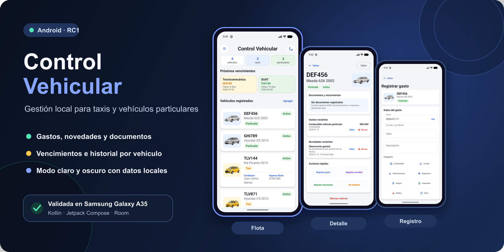
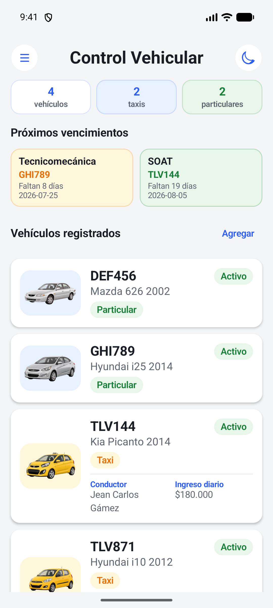
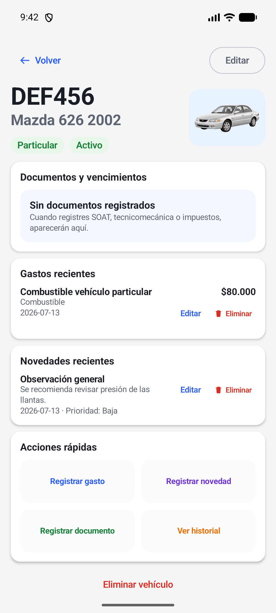
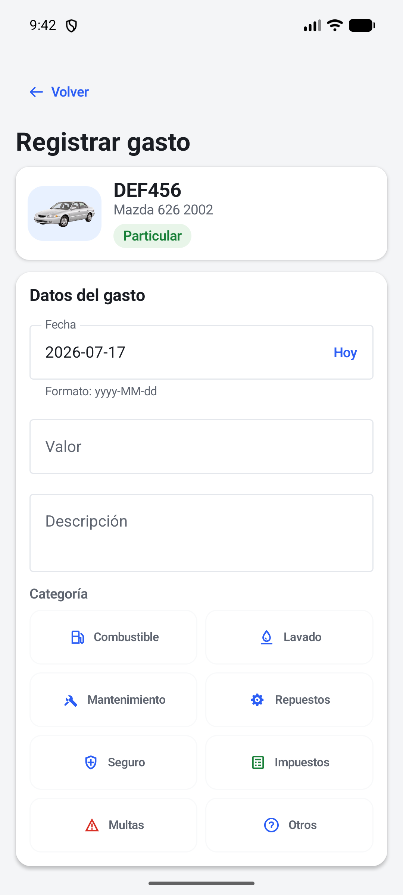
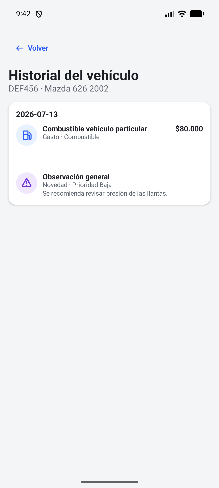

# Control Vehicular

Aplicación Android para administrar una flota pequeña de taxis y vehículos particulares. Centraliza gastos, novedades, documentos, vencimientos e historial en una experiencia local, rápida y fácil de consultar.



## Estado del proyecto

La aplicación se encuentra en la versión candidata `1.0.0-rc1`. La compilación actual ya fue instalada y validada manualmente en un Samsung Galaxy A35, incluyendo navegación, persistencia de datos y funcionamiento en modo claro y oscuro.

El proyecto es académico y fue desarrollado como parte del proceso de formación ADSO.

## Capturas

| Panel principal | Detalle del vehículo |
| --- | --- |
|  |  |
| **Registro de gasto** | **Historial del vehículo** |
|  |  |

## Funcionalidades principales

- Crear, editar y eliminar vehículos.
- Diferenciar taxis y vehículos particulares.
- Mostrar imágenes identificables para los vehículos configurados.
- Registrar, editar y eliminar gastos y novedades.
- Administrar documentos y fechas de vencimiento.
- Destacar próximos vencimientos según su urgencia.
- Consultar el historial de cada vehículo agrupado por fecha.
- Calcular el resumen económico diario de los taxis.
- Consultar reportes básicos de la flota.
- Alternar entre modo claro y modo oscuro.
- Conservar la información localmente con Room.

## Flota configurada

La versión actual incluye datos iniciales e imágenes para cuatro vehículos:

| Vehículo | Modelo | Tipo |
| --- | ---: | --- |
| Hyundai i10 | 2012 | Taxi |
| Kia Picanto | 2014 | Taxi |
| Hyundai i25 | 2014 | Particular |
| Mazda 626 | 2002 | Particular |

## Tecnologías

- Kotlin.
- Jetpack Compose.
- Material Design 3.
- Room y SQLite.
- ViewModel y StateFlow.
- Gradle Kotlin DSL.

## Requisitos

- Android Studio con el JDK incluido.
- Android SDK 36.
- Emulador o dispositivo con Android 7.0 (API 24) o superior.
- Depuración USB habilitada para instalar directamente en un celular.

## Cómo ejecutar el proyecto

1. Clonar el repositorio.
2. Abrir la carpeta del proyecto en Android Studio.
3. Esperar a que finalice la sincronización de Gradle.
4. Seleccionar un emulador o dispositivo Android.
5. Pulsar **Run**.

El proyecto usa Gradle Wrapper, por lo que no es necesario instalar Gradle manualmente.

### Instalar en un celular Android

1. Activar las opciones de desarrollador y la depuración USB.
2. Conectar el celular y aceptar la autorización de depuración.
3. Confirmar que el equipo aparece con:

```bash
adb devices
```

4. Instalar la compilación de desarrollo:

```bash
./gradlew installDebug
```

También se puede generar el APK con:

```bash
./gradlew assembleDebug
```

El archivo resultante queda en `app/build/outputs/apk/debug/app-debug.apk`.

## Verificación

Ejecutar las pruebas unitarias:

```bash
./gradlew testDebugUnitTest
```

Revisar el proyecto con Android Lint:

```bash
./gradlew lintDebug
```

Ejecutar las pruebas instrumentadas con un dispositivo o emulador conectado:

```bash
./gradlew connectedDebugAndroidTest
```

Generar la aplicación debug:

```bash
./gradlew assembleDebug
```

## Persistencia y alcance

Los datos se almacenan únicamente en el dispositivo mediante Room. Desinstalar la aplicación o borrar sus datos puede eliminar la información registrada.

La versión actual no incluye:

- Inicio de sesión.
- Firebase o sincronización en la nube.
- Notificaciones del sistema Android.
- Copias de seguridad automáticas.
- Exportación a PDF o Excel.

## Estructura general

```text
app/src/main/java/com/ivanmadrid/vehiclecontrolapp/
├── data/
├── domain/
├── presentation/
├── ui/
├── utils/
└── MainActivity.kt
```

- `data`: base de datos, entidades, DAOs, repositorios y datos iniciales.
- `domain`: modelos principales del negocio.
- `presentation`: pantallas, componentes y ViewModels.
- `ui`: tema y fundamentos visuales de Jetpack Compose.
- `utils`: utilidades de fechas, validaciones y cálculos.

## Documentación

La carpeta [`docs`](./docs/) contiene la descripción del proyecto, requisitos funcionales, modelo de datos, navegación, decisiones técnicas, diseño de interfaz, migraciones de Room y validación del MVP.

Documentos destacados:

- [Descripción del proyecto](./docs/01-descripcion-proyecto.md)
- [Requisitos funcionales](./docs/02-requisitos-funcionales.md)
- [Modelo de datos](./docs/03-modelo-datos.md)
- [Flujo de navegación](./docs/04-flujo-navegacion.md)
- [Diseño de interfaz](./docs/07-diseño-ui.md)
- [Validación de la entrega MVP 1.0](./docs/11-entrega-mvp-1.0.md)

## Próximos pasos

- Continuar las pruebas de uso en el Samsung Galaxy A35.
- Mejorar los reportes con selección de periodos.
- Incorporar filtros al historial.
- Evaluar recordatorios de vencimientos.
- Diseñar una opción de copia de seguridad o exportación.
- Considerar sincronización en la nube en una etapa posterior.

## Autor

Ivan Dario Madrid Daza
